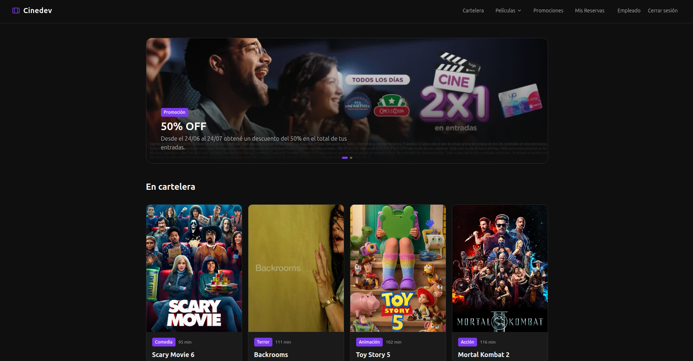
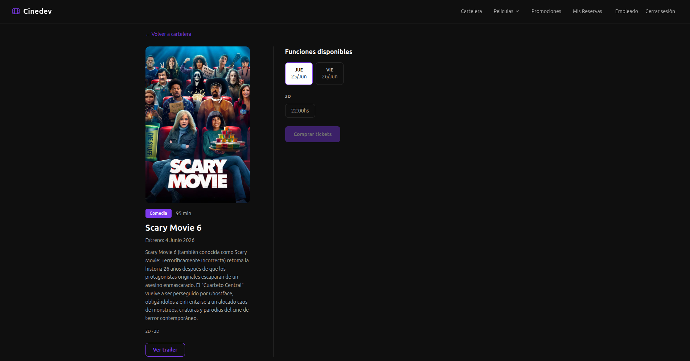
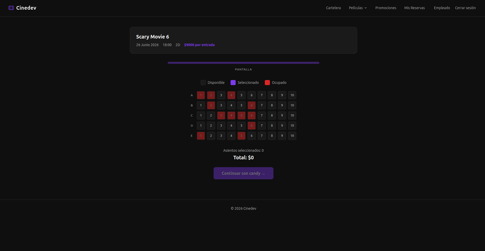
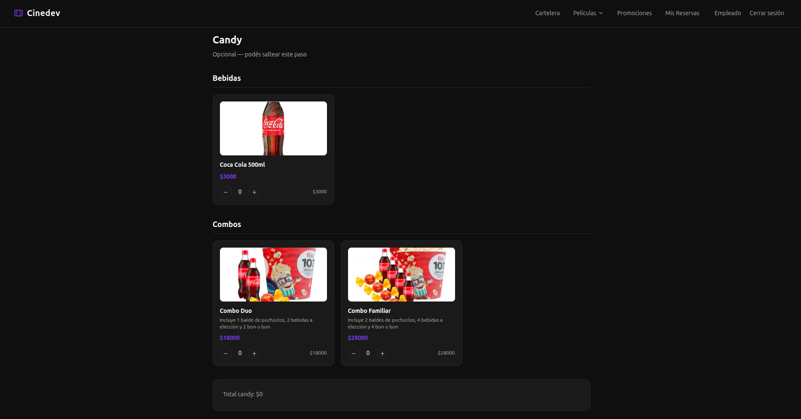
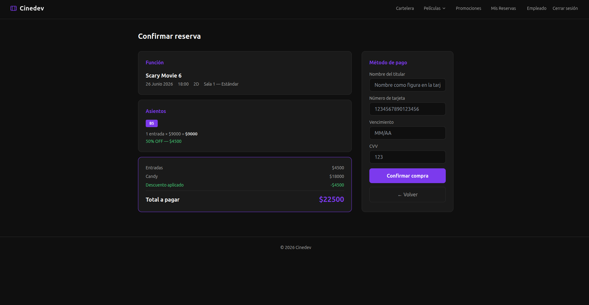
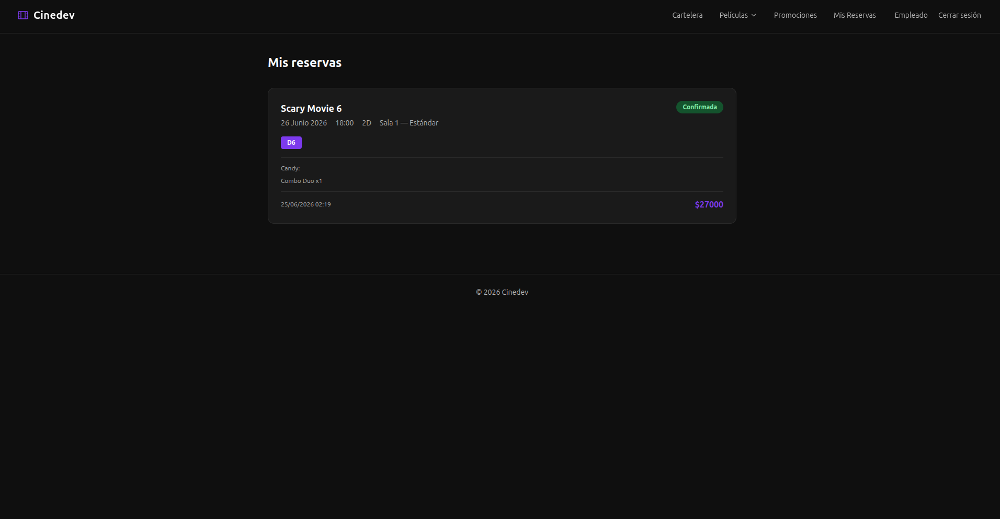
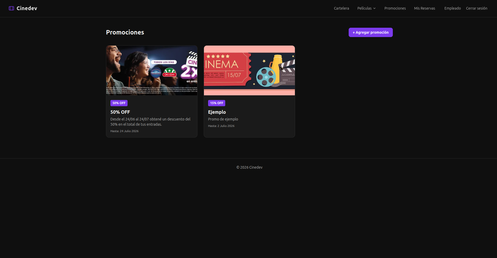

# 🎬 CineApp

Sistema de gestión de cine desarrollado con Django. Permite ver la cartelera, seleccionar funciones, elegir asientos, agregar candy y confirmar reservas.

## Capturas

### Home — Cartelera


### Detalle de película


### Selección de asientos


### Selección de candy


### Confirmación de reserva


### Mis Reservas


### Promociones


## Tecnologías
- Python 3.12
- Django 5.x
- Tailwind CSS (CDN)
- JavaScript
- SQLite

## Apps
- `peliculas` — cartelera y detalle de películas
- `funciones` — funciones por película (fecha, hora, formato, precio)
- `salas` — salas y asientos
- `reservas` — flujo de compra de entradas
- `promociones` — promociones con descuentos
- `candy` — productos del candy bar
- `usuarios` — registro, login y logout

## Instalación

```bash
# Clonar el repositorio
git clone https://github.com/facundo-puig/tp-cine-django.git
cd tp_cine

# Crear entorno virtual
python -m venv venv
source venv/bin/activate

# Instalar dependencias
pip install -r requirements.txt

# Migrar base de datos
python manage.py migrate

# Crear superusuario
python manage.py createsuperuser

# Correr el servidor
python manage.py runserver
```

## Credenciales de prueba
- **Admin:** usuario: `admin` / contraseña: `admin`
- **Empleado:** usuario: `empleado` / contraseña: `clave123`

## Integrantes
- Facundo Puig
- Gonzalo Riva